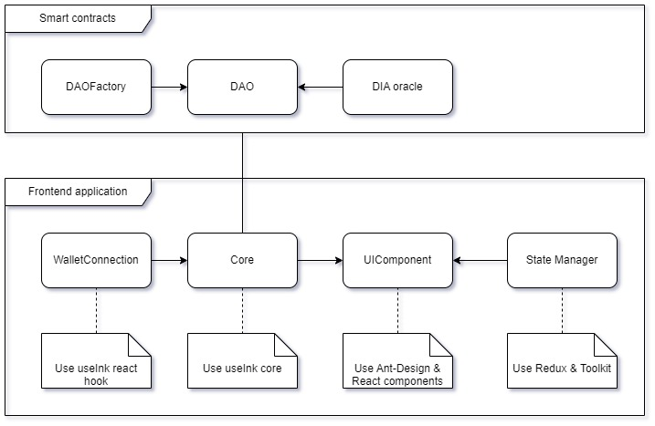

## Introduction
Grant me is a DAO-based platform for local government funding programs with procedural steps for various administration groups.

## Demo information
- [Frontend Application](https://grantme.a2n.finance)
- [Video demo](https://www.youtube.com/watch?v=zrCKjRusJmo)


For more detailed information on product features, you can refer to [our project description on TaiKai.](https://taikai.network/alephzero/hackathons/CTRL-Hack-ZK/projects/clrpxejbo05k4vn01hzl9xdv7/idea)

## Key ideas
The core concept of GrantMe is to empower organizations to establish DAOs without the need for coding skills, offering a flexible step-by-step process. This mechanism is designed to adapt seamlessly to various types of workflows.


## Architecture


- We utilize Ink! for smart contract development, ensuring each smart contract undergoes thorough unit testing and end-to-end testing. These smart contracts are then deployed on the AlephZero Testnet.
- For frontend development, our tech stack includes useInk hooks, useInk core, NextJS, Redux & Toolkit, and Ant Design.
- To facilitate the conversion from USD to TZERO token, we integrate the DIA oracle.

Frontend source code explanation:

- [Core components](frontend/src/core/) contain crucial code blocks for interacting with smart contracts.
- [State manager](frontend/src/controller/) includes Redux reducers for managing actions and app states.
- [UI components](frontend/src/components/) consist of React components for all pages.

## Smart contracts

GrantMe includes two main contracts:
- DAOFactory
    - File: [dao_factory/lib.rs](contracts/dao_factory/lib.rs)
    - Metadata: [dao_factory.json](frontend/src/contracts/dao_factory.json)
    - Deployed address: 5DJxwt8P4yrQfQ2Vrvt9KpDy3dnN8DpBqSdt4qQtcnxfZSYr

- DAO:
    - File: [dao/dao_contract.rs](contracts/dao/dao_contract.rs)
    - Metadata: [dao.json](frontend/src/contracts/dao.json)
    - An example DAO address: 5CXoKtt3tkaCfSjoX9jgJnMaPvNTKkH6M2wtsBA6VbY1wK1v 

## Installation

To build & test smart contract:
- Go to smart contract folder, e.g ```cd contracts/dao```
- To build: ```cargo +nightly build```
- To test:
    - Unit tests only: ```cargo +nightly test```
    - Unit tests & E2E tests: ```cargo +nightly test --features e2e-tests```


To interact or deploy smart contracts, you can use [contracts-ui](https://contracts-ui.substrate.io/).

To run GrantMe frontend application:
- ```cd frontend```
- ```npm i```
- ```cp .env.example .env```
- ```npm run dev``` for the dev mode
- ```npm run build``` & ```npm run start``` for the production mode.


